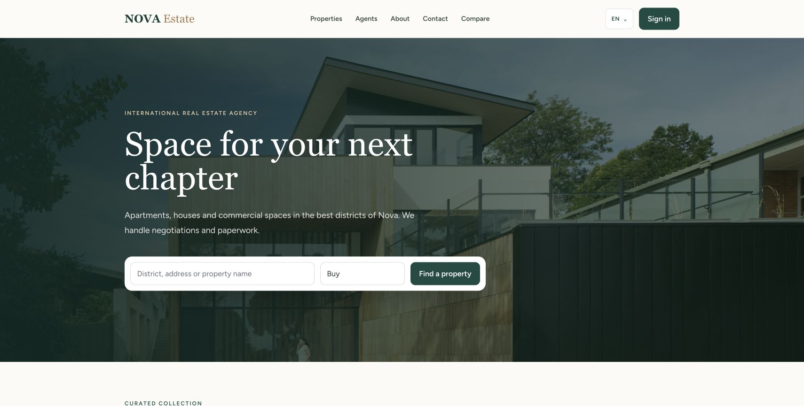
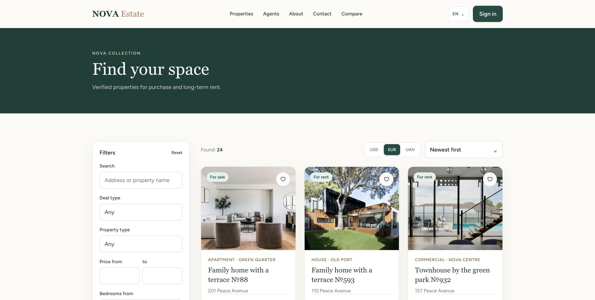
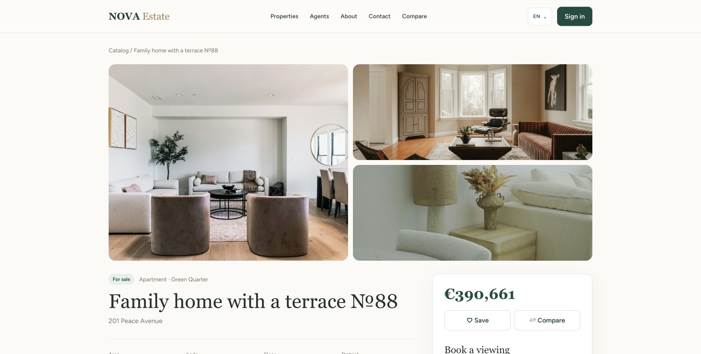
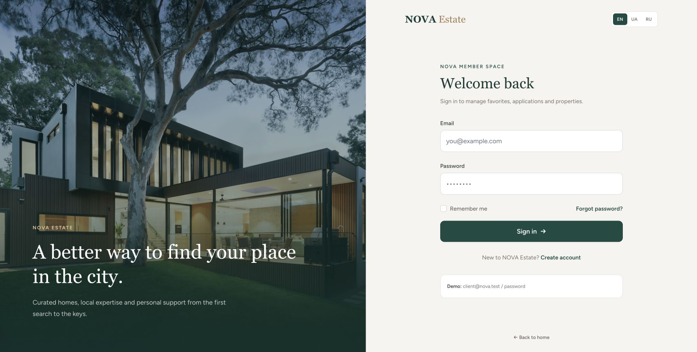

<div align="center">

# NOVA Estate

### Multilingual real estate marketplace and operations platform

[](https://laravel.com)
[](https://vuejs.org)
[](https://inertiajs.com)
[](https://www.typescriptlang.org)
[](#quality-assurance)

NOVA Estate combines a polished property discovery experience with a role-based workspace for clients, agents and administrators. It is designed to support the complete journey from the first search to a managed viewing request.

</div>



## Product overview

NOVA Estate gives a real estate business one consistent platform for presenting its portfolio, collecting qualified enquiries and managing day-to-day operations. Visitors can explore verified listings in their preferred language and currency, while internal teams can work with properties, applications, reference data and user access from dedicated dashboards.

The current seed package provides a ready-to-review portfolio of 24 properties, 72 gallery images, agents, clients and application history. All listing images are stored locally, so the interface remains fast and does not depend on third-party image availability at runtime.

## Core capabilities

### Property discovery

- Responsive landing page with featured inventory and direct search.
- Catalog with server-side search, deal type, property type, price, room, area and district filters.
- Sorting by publication date, price and floor area.
- Localized pagination with a clear disabled state.
- Detailed property pages with image galleries, specifications, amenities and assigned agents.
- Favorites for authenticated clients and local comparison of up to four listings.
- Currency display in USD, EUR and UAH.

### International experience

- English, Ukrainian and Russian interface; English is the default locale.
- Database-backed translations for property titles, descriptions, addresses and districts.
- Localized property types, amenities, statuses, filters and pagination.
- Locale and currency preferences persist between page visits.

### Lead and application management

- Viewing requests attached to individual properties.
- General consultation requests from the public website.
- Application lifecycle: new, in progress, meeting scheduled, completed and cancelled.
- Administrative search by client, phone, email or property.
- Filters by status, assigned agent and date range.
- Sorting by newest, oldest or status.
- Agent assignment and status updates directly from the application list.

### Role-based workspaces

| Role | Main capabilities |
| --- | --- |
| Client | Profile management, favorites, application history and property comparison |
| Agent | Assigned applications, owned property inventory, listing creation and editing |
| Administrator | All applications and properties, user roles, account blocking and reference data |

Authorization is enforced on the server through middleware and policies rather than relying on hidden interface controls.

### Property and user administration

- Create, update and remove property listings.
- Draft, moderation, published, sold and rented states.
- Multiple image uploads with gallery management.
- Assignment of agents, amenities and property types.
- User role management and account blocking.
- Responsive tables with stable column sizing for long localized content.
- Unified SVG navigation icon system across all dashboards.

## Interface

### Searchable property catalog



Every seeded property has an individual cover image. Rental values use a monthly pricing range separate from sale inventory, and card layouts remain aligned when titles or translated labels vary in length.

### Property presentation



The detail view combines a three-image gallery, localized property data, currency conversion, agent information, favorites, comparison and a viewing request form.

### Branded member access



Authentication and profile screens use the same visual system as the public marketplace instead of framework-default layouts.

## Technology stack

| Layer | Technology |
| --- | --- |
| Backend | PHP 8.3+, Laravel 13.32, Eloquent ORM |
| Frontend | Vue 3, TypeScript, Inertia.js 2.0 |
| Styling | Tailwind CSS 3, custom NOVA design system |
| Database | PostgreSQL for application environments, SQLite for lightweight local use and tests |
| Tooling | Vite 8, vue-tsc, Laravel Pint, PHPUnit |

## Architecture

```text
Browser / Vue 3
      │
      │ Inertia requests and responses
      ▼
Laravel routes ── middleware ── controllers ── policies
      │                                  │
      ├── public catalog                 ├── role authorization
      ├── authentication                 ├── validation
      ├── client workspace               └── application workflows
      ├── agent workspace
      └── administration
                         │
                         ▼
              Eloquent models / database
```

Main domain entities include users, properties, property types, amenities, property images, favorites, applications and contact requests.

## Local installation

### Requirements

- PHP 8.3 or newer with PDO and the required database extension
- Composer 2
- Node.js 20 or newer and npm
- PostgreSQL, or SQLite for the lightweight setup

### PostgreSQL setup

```bash
git clone https://github.com/chikbob/nova-estate.git
cd nova-estate
cp .env.example .env

docker compose up -d postgres
composer install
php artisan key:generate
php artisan migrate:fresh --seed
php artisan storage:link

npm install
npm run dev
```

Start Laravel in a second terminal:

```bash
php artisan serve
```

Open `http://127.0.0.1:8000`.

### SQLite setup

Set `DB_CONNECTION=sqlite` in `.env`, remove the other active `DB_*` values, then run:

```bash
touch database/database.sqlite
composer install
php artisan key:generate
php artisan migrate:fresh --seed
npm install
npm run dev
php artisan serve
```

## Demo access

All seeded accounts use the password `password`.

| Role | Email |
| --- | --- |
| Administrator | `admin@nova.test` |
| Agent | `alina@nova.test` |
| Agent | `mark@nova.test` |
| Agent | `sofia@nova.test` |
| Client | `client@nova.test` |

These accounts and all catalog contact details are fictional sample data intended for local product evaluation.

## Quality assurance

```bash
# Backend behavior and authorization
php artisan test --compact

# Type checking and production assets
npm run build

# PHP code style
vendor/bin/pint --dirty --format agent
```

Current status: **35 tests passing with 117 assertions**, successful TypeScript validation and successful production build.

The feature suite covers authentication, profile management, role restrictions, property publication, localized catalog data, favorites, applications, administration and application filtering.

## Project structure

```text
app/
├── Http/Controllers/       Public and workspace workflows
├── Http/Middleware/        Role enforcement
├── Http/Requests/          Property and profile validation
├── Models/                 Eloquent domain models
└── Policies/               Resource authorization

database/
├── factories/              Realistic generated records
├── migrations/             Application schema and translations
└── seeders/                Review-ready catalog and accounts

resources/js/
├── Components/             Cards, pagination and shared UI
├── composables/            Locale and currency state
├── Layouts/                Public, guest and dashboard shells
└── Pages/                  Inertia page components

docs/screenshots/           Product screenshots used in this README
tests/Feature/              Application behavior tests
```

## Data and imagery

The NOVA Estate brand, city, users, addresses and listing details in the seed data are fictional. Property photography is sourced from [Unsplash](https://unsplash.com) under the Unsplash License and stored locally for predictable development and review environments.
